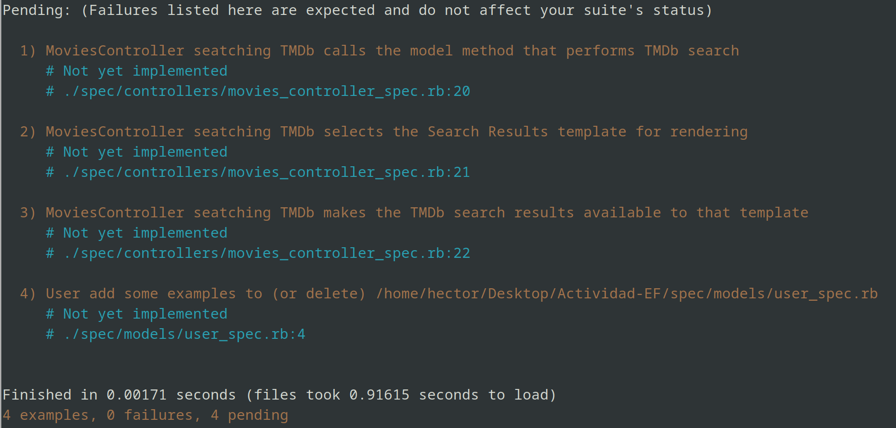
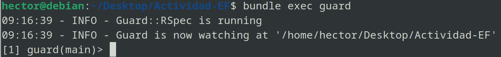
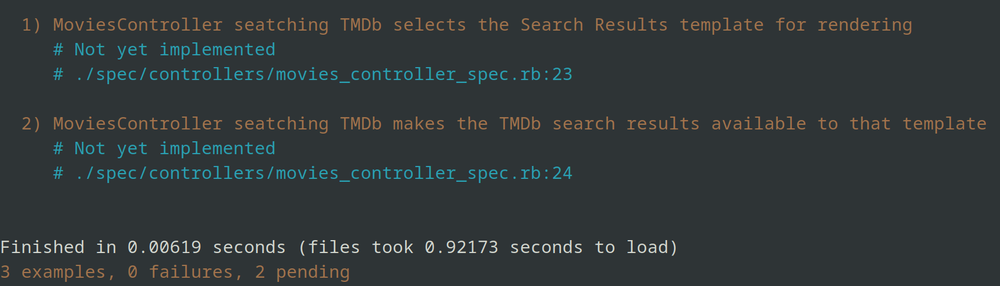
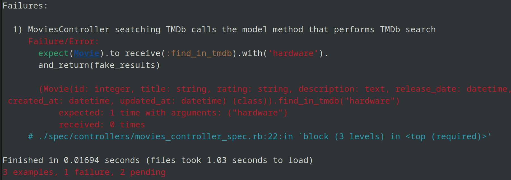
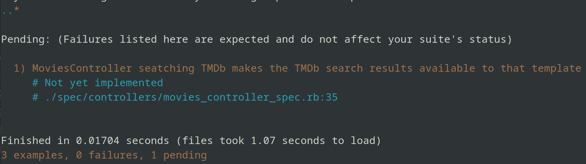

# Parte 1
## Pregunta 1
En caso se hayan realizado cambios en nuestro repositorio remoto, mientras nosotros haciamos cambios en nuestro repo local, tendremos problemas al momento de hacer un `git push`. 


Primero debemos "jalar" los cambios en el repo remoto, para luego intentar "mezclarlos", utilizando los comandos `git fetch` y `git merge`.


En caso no se puedan mezclar de manera automática, tendremos que resolver el conflicto manualmente. Para esto, debemos usar un editor para abrir el archivo o archivos en conflicto para resolver este conflicto. 


Los conflictos estarán marcados con <<<<<, ===== y >>>>>. Ahora solo queda elegir con cual versión quedarnos, o en todo caso que modificaciones hacer para incorporar estas dos versiones. Una vez resuelto, con `git add, git commit` ya podremos "empujar" nuestro repo local al remoto.


## Pregunta 2
Supongamos que tengamos el modelo User de la siguiente manera:

```ruby
class User < ActiveRecord::Base
    validates :username, :presence => true
    validate :username_format
end
```

**¿Qué pasa si tenemos @user sin nombre de usuario y llamamos a @user.valid? ¿Qué guardará @user.save?**  
`.valid?` arrojará True o False si es que el objeto pasa las validaciones. Como en el modelo de User validamos la presenia de un username, `@user.valid?` nos arrojará False; y por tanto, no se guardará al momento de usar `@user.save`


**Implementacion de `username_format`**
Rails nos permite crear validaciones personalizadas, como es el caso de `username_format`. En este caso queremos que los nombres de usuario no excedan los 10 caracteres, y que siempre empiecen con una letra:

```ruby
def username_format
    if username.length > 10
      errors.add(:username, "cant be longer than 10 characters")
    end

    if !username.match(/^[a-zA-Z]/)
      errors.add(:username, "must start with a letter")
    end
end
```

Rails además nos permite agregar nuestros propios mensajes de error a las validaciones, para asi tener una mejor visualización de qué es lo que esta saliendo mal.

Ahora, si intentamos guardar usuarios con usernames muy largos o que empiezan con algo que no sea una letra, no nos lo permitirá.


# Parte 2

## Paso 1  
Editamos la vista correspondiente para `search_tmdb.html.erb` para configurar el formulario de busqueda y un boton para regresar a la pagina de inicio, y un boton en la pantalla de inicio para ir al formulario de busqueda de `search_tmdb`.

Configuracion del formulario:
  

Boton de regreso a Inicio:

  

Boton de busqueda en Inicio:
  


Ademas, para que se muestre al usuario agregamos la ruta `get '/search_tmdb' => 'movies#search_tmdb'` asi como una accion del controlador movies llamada `search_tmdb` para poder renderizar esta vista.

Además, vamos dando forma a las pruebas de esta accion del controlador en `spec/controllers/movie_controller_spec.rb`

  

Al usar `bundle exec rspec` nos mostraran estos tests con implementacion pendiente



Y ahora inicializamos Guard para que pueda observar los cambios en `/spec` y realice las pruebas de manera automática



## Paso 2

Modificamos una de las pruebas de la siguiente manera:

```ruby
it 'calls the model method that performs TMDb search' do
    get :search_tmdb, {:search_terms => 'hardware'}
end
```

Guard ejecutara la prueba automaticamente, y observaremos que esta prueba ya esta en verde, pues ya tenemos una ruta `get /search_tmdb` y una accion del controlador definida para esta ruta.



Volvemos a modificar esta prueba, ahora de la siguiente manera:

```ruby
it 'calls the model method that performs TMDb search' do
    fake_results = [double('movie1'), double('movie2')]
    expect(Movie).to receive(:find_in_tmdb).with('hardware').and_return(fake_results)
    get :search_tmdb, {:search_terms => 'hardware'}
end
```

Observamos que esta prueba falla:



Esta prueba falla porque espera que la accion del controlador llame al metodo `find_in_tmdb` del modelo para `Movie`, pero nuestra accion del controlador esta vacia. Si modificamos la acción `search_tmdb` de MoviesController para que llame a este método del modelo, nuestra prueba pasará. 

```ruby
def search_tmdb
    @movies = Movie.find_in_tmdb(params[:search_terms])
end
```


No es necesario todavía verificar la implementación de `find_in_tmdb` porque estamos utilizando **mocks** para simular su comportamiento.

Es importante que `expect` este definido antes de la solicitud GET porque `expect` establece la expectativa despues de su definición en adelante. Si se tiene la solicitud GET antes, esta se procesará y culminará antes de siquiera haber definido el `expect`, y por tanto el comportamiento deseado no sera capturado. Si invertimos el orden de estas sentencias observamos que la prueba falla:


## Paso 3
Ahora, modificamos la 2da prueba:

```ruby
it 'selects the Search Results template for rendering' do
  fake_results = [double('movie1'), double('movie2')]
  allow(Movie).to receive(:find_in_tmdb).and_return(fake_results)
  get :search_tmdb, {:search_terms => 'hardware'}
  expect(response).to render_template('search_tmdb')
end
```

Esta prueba, mediante `response` y `render_template` verificará si al llamar al metodo del controlador con los parámetros definidos se renderiza la vista `search_tmdb`. Al ya tener definida la ruta podemos observar que la prueba pasa satisfactoriamente.



Ahora, podemos refactorizar las pruebas para que antes de cada una de estas se creen los mocks, así no caemos en repeticiones innecesarias de código.

```ruby
describe 'seatching TMDb' do
    before :each do
      @fake_results = [double('movie1'), double('movie2')]
    end
# [...]
```


