# Parte 1
## Pregunta 1
En caso se hayan realizado cambios en nuestro repositorio remoto, mientras nosotros haciamos cambios en nuestro repo local, tendremos problemas al momento de hacer un `git push`. 

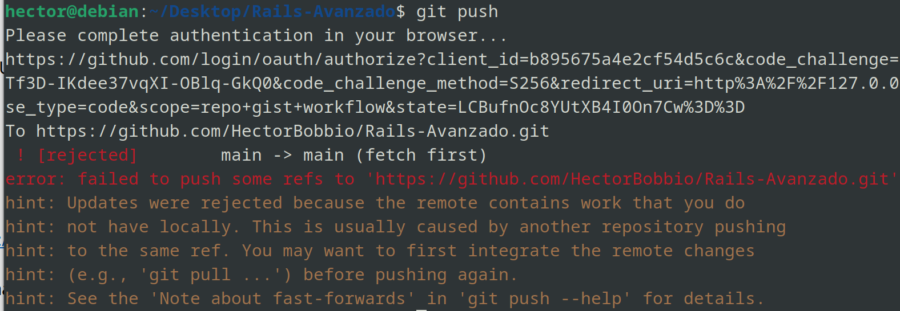

Primero debemos "jalar" los cambios en el repo remoto, para luego intentar "mezclarlos", utilizando los comandos `git fetch` y `git merge`.

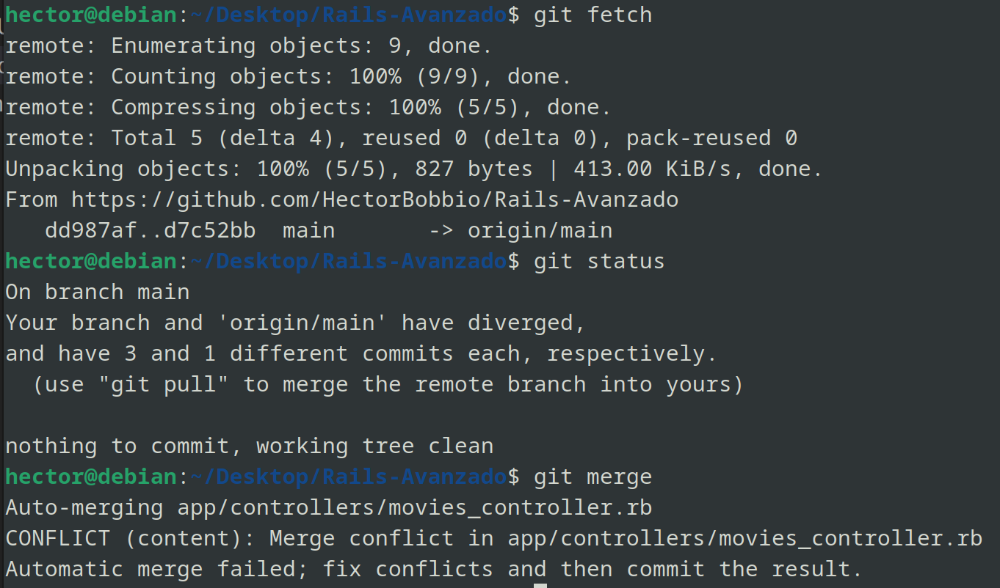

En caso no se puedan mezclar de manera automática, tendremos que resolver el conflicto manualmente. Para esto, debemos usar un editor para abrir el archivo o archivos en conflicto para resolver este conflicto. 

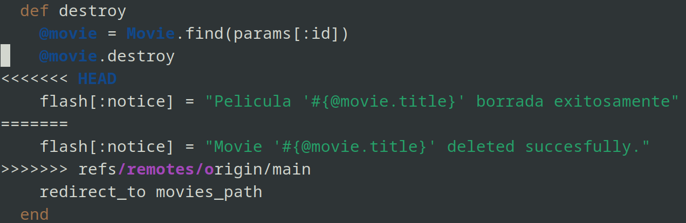

Los conflictos estarán marcados con <<<<<, ===== y >>>>>. Ahora solo queda elegir con cual versión quedarnos, o en todo caso que modificaciones hacer para incorporar estas dos versiones. Una vez resuelto, con `git add, git commit` ya podremos "empujar" nuestro repo local al remoto.

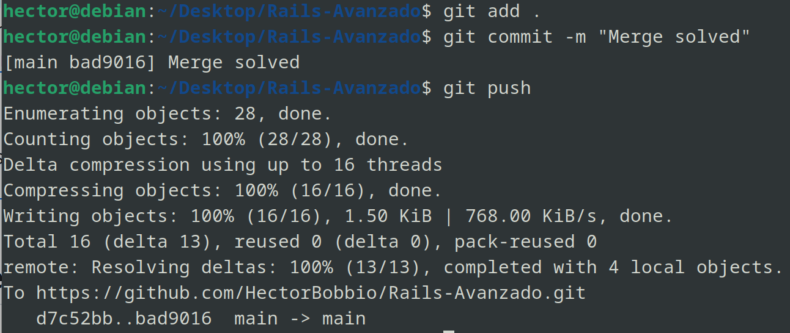

## Pregunta 2
Supongamos que tengamos el modelo User de la siguiente manera:

```ruby
class User < ActiveRecord::Base
    validates :username, :presence => true
    validate :username_format
end
```

**¿Qué pasa si tenemos @user sin nombre de usuario y llamamos a @user.valid? ¿Qué guardará @user.save?**  
`.valid?` arrojará True o False si es que el objeto pasa las validaciones. Como en el modelo de User validamos la presenia de un username, `@user.valid?` nos arrojará False; y por tanto, no se guardará al momento de usar `@user.save`

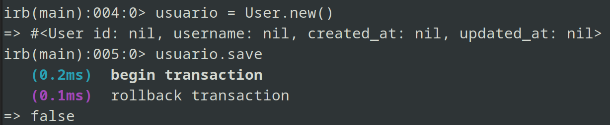

**Implementacion de `username_format`**
Rails nos permite crear validaciones personalizadas, como es el caso de `username_format`. En este caso queremos que los nombres de usuario no excedan los 10 caracteres, y que siempre empiecen con una letra:

```ruby
def username_format
    if username.length > 10
      errors.add(:username, "cant be longer than 10 characters")
    end

    if !username.match(/^[a-zA-Z]/)
      errors.add(:username, "must start with a letter")
    end
end
```

Rails además nos permite agregar nuestros propios mensajes de error a las validaciones, para asi tener una mejor visualización de qué es lo que esta saliendo mal.

Ahora, si intentamos guardar usuarios con usernames muy largos o que empiezan con algo que no sea una letra, no nos lo permitirá.

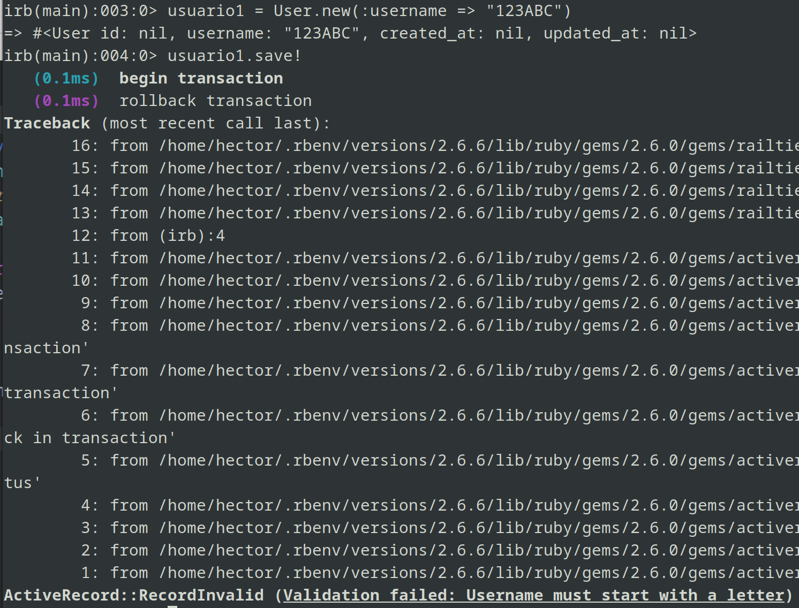
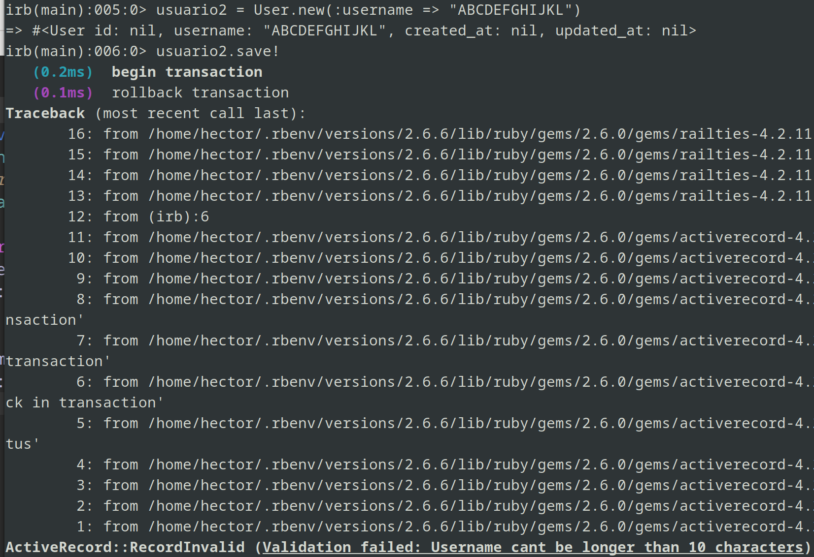

# Parte 2

## Paso 1  
Editamos la vista correspondiente para `search_tmdb.html.erb` para configurar el formulario de busqueda y un boton para regresar a la pagina de inicio, y un boton en la pantalla de inicio para ir al formulario de busqueda de `search_tmdb`.

Configuracion del formulario:
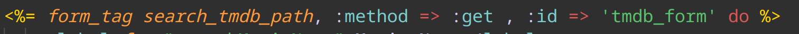  

Boton de regreso a Inicio:
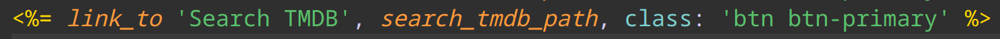
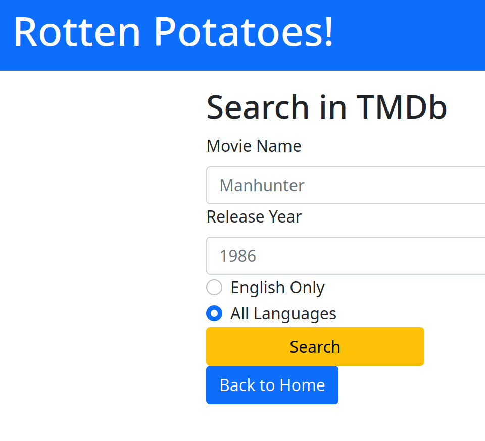  

Boton de busqueda en Inicio:
  
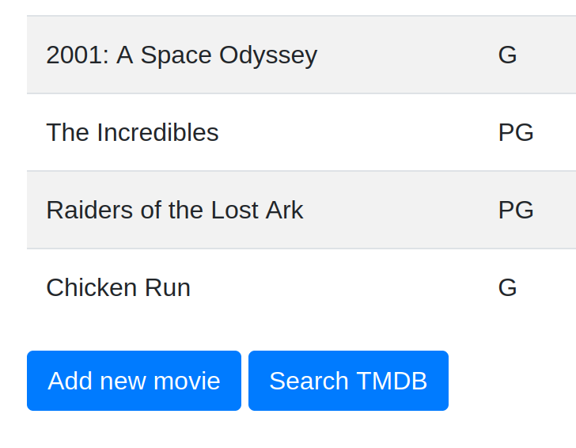

Ademas, para que se muestre al usuario agregamos la ruta `get '/search_tmdb' => 'movies#search_tmdb'` asi como una accion del controlador movies llamada `search_tmdb` para poder renderizar esta vista.

Además, vamos dando forma a las pruebas de esta accion del controlador en `spec/controllers/movie_controller_spec.rb`

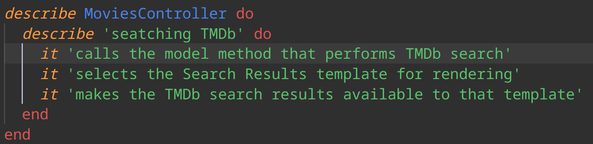  


